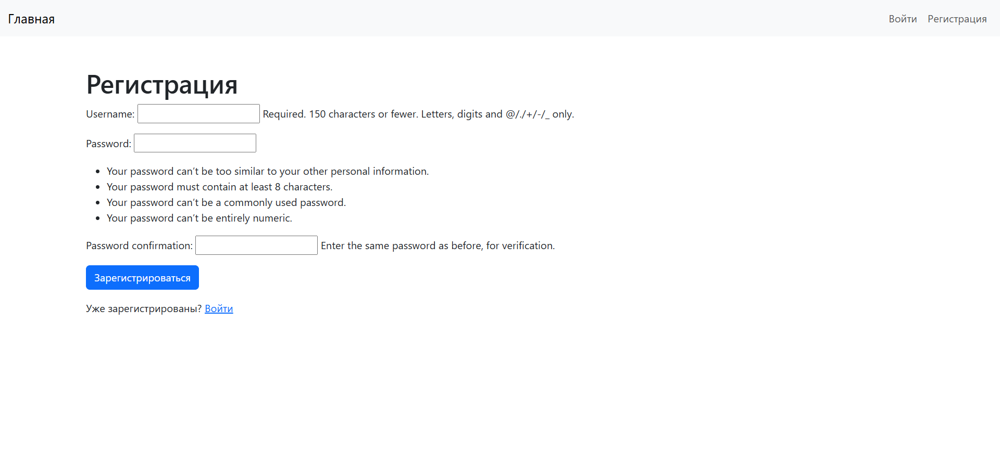
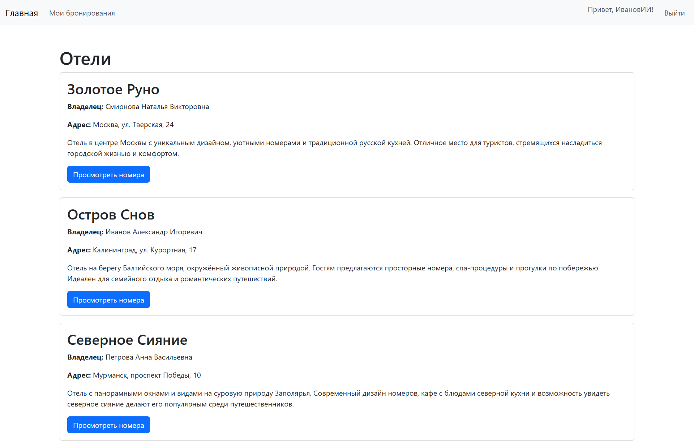
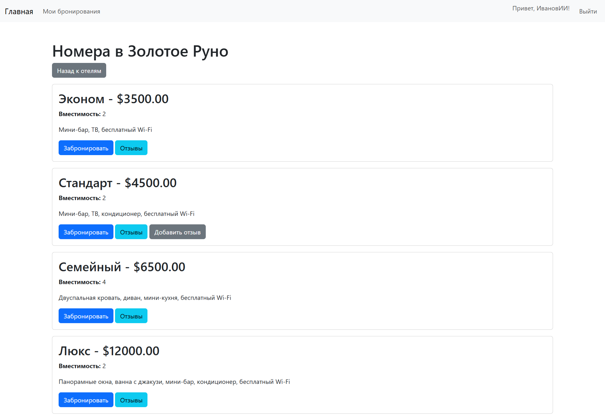
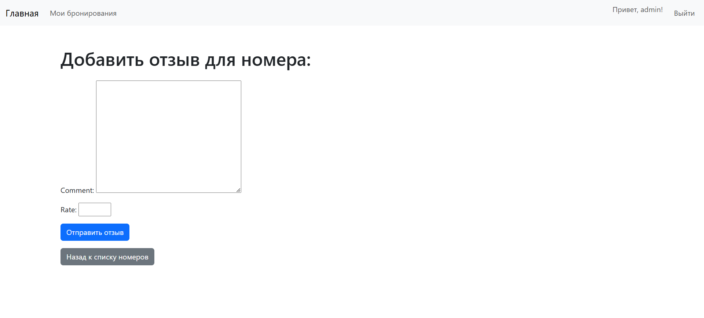
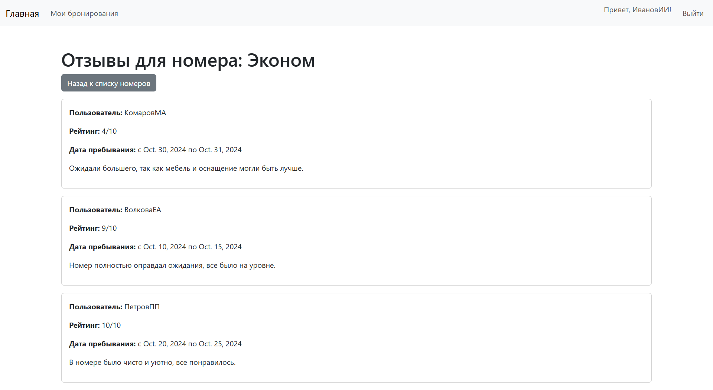
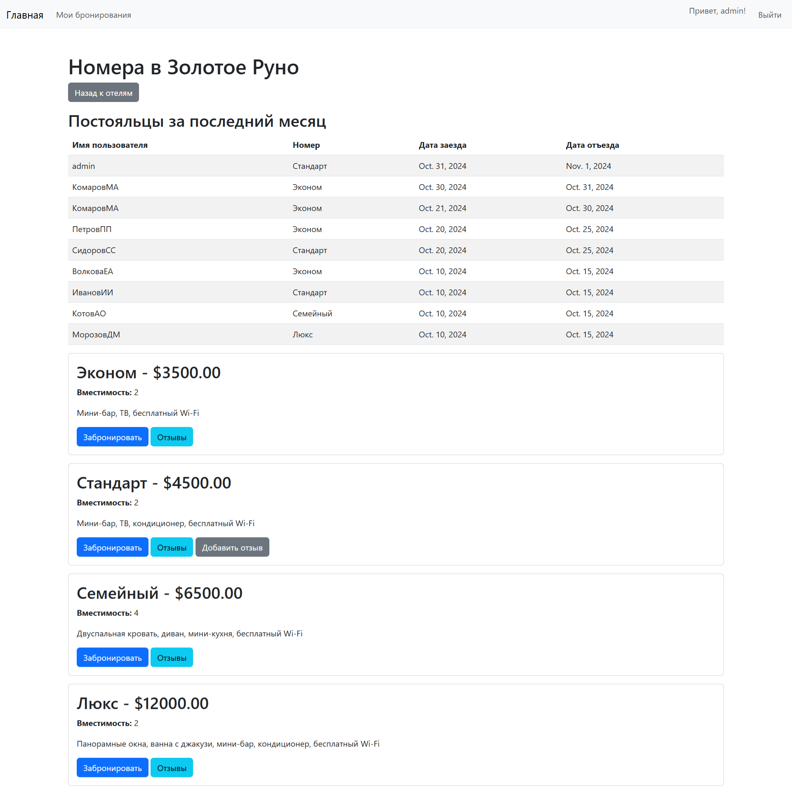

# Отчёт о выполнении задания: Реализация простого сайта списка отелей с помощью Django

## Описание
Сайт позволяет пользователям регистрироваться, бронировать номера в отелях, оставлять отзывы, а администраторам – управлять бронированиями через Django-admin и просматривать постояльцев за последний месяц.

---

## Основной функционал

### 1. Регистрация пользователей
- Пользователи могут зарегистрироваться через форму, войти в систему и получить доступ к функциям бронирования и отзывов.

  

```python
# Регистрация пользователя
class RegisterView(CreateView):
    form_class = UserCreationForm
    template_name = 'accounts/register.html'
    success_url = reverse_lazy('login')
```

### 2. Просмотр и бронирование номеров
- На странице отеля отображаются номера с ценой, вместимостью и удобствами.
- Пользователи могут бронировать номера и управлять своими бронированиями (редактировать и удалять).






```python
# Просмотр номеров отеля
def get_room_list(request, hotel_id):
    hotel = get_object_or_404(Hotel, id=hotel_id)
    rooms = hotel.room_set.all()
    today = timezone.now().date()
    user = request.user if request.user.is_authenticated else None

    for room in rooms:
        room.can_leave_review = False
        if user:
            has_review = Review.objects.filter(
                reservation__user=user,
                reservation__room=room
            ).exists()

            if not has_review:
                reservations = Reservation.objects.filter(
                    user=user,
                    room=room,
                    start_date__lte=today
                )
                if reservations.exists():
                    reservations_without_review = reservations.exclude(review__isnull=False)
                    if reservations_without_review.exists():
                        room.can_leave_review = True
                        room.reservation_id_for_review = reservations_without_review.first().id

    context = {'hotel': hotel, 'rooms': rooms}

    if request.user.is_staff:
        one_month_ago = today - timedelta(days=30)
        last_month_guests = Reservation.objects.filter(
            room__hotel=hotel,
            start_date__lte=today,
            end_date__gte=one_month_ago,
        ).order_by('-start_date')
        context['last_month_guests'] = last_month_guests

    return render(request, 'rooms/room_list.html', context)
```

```python
# Создание бронирования
@login_required(login_url='/login/')
def create_reservation(request, room_id):
    room = get_object_or_404(Room, id=room_id)
    if request.method == 'POST':
        form = ReservationForm(request.POST)
        if form.is_valid():
            reservation = form.save(commit=False)
            reservation.user = request.user
            reservation.room = room
            reservation.save()
            return redirect('reservation_list')
    else:
        form = ReservationForm()
    return render(request, 'reservations/create_reservation.html', {'form': form, 'room': room})
```

### 3. Отзывы к номерам
- После проживания пользователь может оставить отзыв с оценкой (1-10) и текстом комментария.





```python
# Оставление отзыва
@login_required(login_url='/login/')
def create_review(request, reservation_id):
    reservation = get_object_or_404(Reservation, id=reservation_id)

    if hasattr(reservation, 'review'):
        messages.error(request, "Вы уже оставили отзыв для этого бронирования.")
        return redirect('room_reviews', room_id=reservation.room.id)

    if request.method == 'POST':
        form = ReviewForm(request.POST)
        if form.is_valid():
            review = form.save(commit=False)
            review.user = request.user
            review.reservation = reservation
            review.save()
            return redirect('room_reviews', room_id=reservation.room.id)
    else:
        form = ReviewForm()
    return render(request, 'rooms/create_review.html', {'form': form, 'reservation': reservation})
```

```python
# Просмотр отзывов для номера
def get_room_reviews(request, room_id):
    room = get_object_or_404(Room, id=room_id)
    reviews = Review.objects.filter(reservation__room=room)
    return render(request, 'rooms/room_reviews.html', {'room': room, 'reviews': reviews})
```

### 4. Управление бронированиями через Django-admin
- Администратор может заселять и выселять пользователей, управлять бронированиями и отзывами в Django-admin.

### 5. Список постояльцев за последний месяц
- В таблице, видимой только администраторам, отображаются постояльцы отеля за последний месяц с датами заезда и отъезда.



---

## Используемые модели

- **Hotel** — название отеля, владелец, адрес, описание.
- **RoomType** — тип номера (Эконом, Стандарт, Семейный, Люкс).
- **Room** — принадлежность к отелю, тип номера, стоимость, вместимость, удобства.
- **Reservation** — связь пользователя с номером, период проживания (даты заезда и выезда).
- **Review** — отзыв к номеру с текстом комментария, рейтингом, датой проживания и пользователем.

```python
from django.contrib.auth.models import User
from django.core.exceptions import ValidationError
from django.core.validators import MinValueValidator, MaxValueValidator
from django.utils import timezone
from django.db import models


class Hotel(models.Model):
    name = models.CharField(max_length=255)
    owner = models.CharField(max_length=255)
    address = models.CharField(max_length=255)
    description = models.TextField()

    def __str__(self):
        return f"Отель «{self.name}»"


class RoomType(models.Model):
    name = models.CharField(max_length=100)

    def __str__(self):
        return self.name


class Room(models.Model):
    hotel = models.ForeignKey(Hotel, on_delete=models.CASCADE)
    room_type = models.ForeignKey(RoomType, on_delete=models.SET_NULL, null=True)
    price = models.DecimalField(max_digits=10, decimal_places=2)
    capacity = models.PositiveIntegerField()
    room_services = models.TextField()

    def __str__(self):
        return f"Номер «{self.room_type}» в отеле «{self.hotel.name}», цена: {self.price} ₽"


class Reservation(models.Model):
    user = models.ForeignKey(User, on_delete=models.CASCADE)
    room = models.ForeignKey(Room, on_delete=models.CASCADE)
    start_date = models.DateField()
    end_date = models.DateField()

    def clean(self):
        if self.start_date <= timezone.now().date():
            raise ValidationError('Дата начала должна быть позже сегодняшнего дня.')

        if self.start_date >= self.end_date:
            raise ValidationError('Дата начала должна быть раньше даты окончания.')

    def __str__(self):
        return f"Бронирование: {self.user.username}, {self.room.room_type} с {self.start_date} по {self.end_date}"


class Review(models.Model):
    reservation = models.OneToOneField(Reservation, on_delete=models.CASCADE)
    comment = models.TextField()
    rate = models.IntegerField(validators=[MinValueValidator(1), MaxValueValidator(10)])

    def __str__(self):
        return f"Отзыв от {self.reservation.user.username} на {self.reservation.room.room_type} - Оценка: {self.rate}/10"

```

---

## Заключение

Сайт выполнен на Django и реализует все необходимые функции: регистрация, бронирование номеров, отзывы, управление через Django-admin.