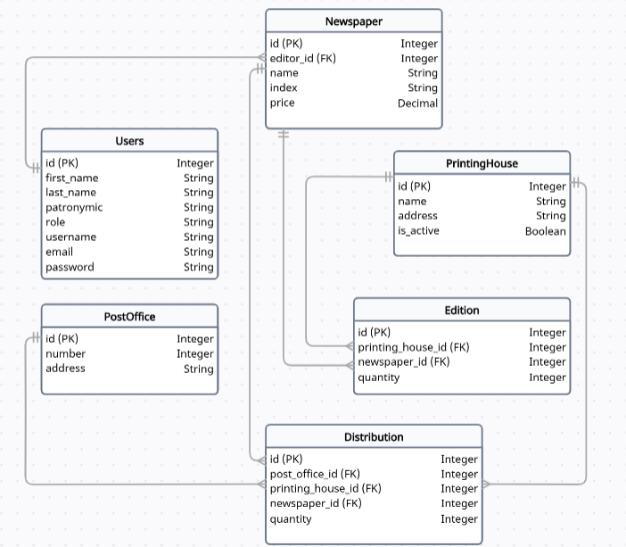

# Лабораторная работа 3. Реализация серверной части на django rest. Документирование API.
Реализация серверной части приложения средствами django и djangorestframework в соответствии с заданием из [текста работы](https://drive.google.com/file/d/1QxQo5jln6soFUj6EmOVEo1yauCo375PP/view?usp=sharing).
## Вариант №6
Создать программную систему, позволяющую отслеживать распределение по почтовым отделениям газет, печатающихся в типографиях города.

Система должна обеспечивать хранение, просмотр и изменение сведений о газетах, почтовых отделениях, получающих газеты и о типографиях, выпускающих газеты. Сведения о газетах включают в себя: название газеты, индекс издания, фамилию, имя и отчество редактора, цену экземпляра газеты. Цены могут меняться. Возможно появление новых газет и изменение индекса существующего издания. Для типографий указываются их названия и адреса.

В типографии разными тиражами печатаются газеты нескольких наименований. Типография может быть закрыта, тогда необходимо скорректировать работу других типографий с учетом потребностей почтовых отделений в газетах.

Почтовое отделение имеет номер и адрес. На каждое почтовое отделение поступают в определенных количествах газеты разных наименований, причем часть экземпляров одной и той же газеты может быть напечатана в одной типографии, а часть – в другой.

Пользователям системы может потребоваться следующая информация:
- По каким адресам печатаются газеты данного наименования?
- Фамилия редактора газеты, которая печатается в указанной типографии самым большим тиражом?
- На какие почтовые отделения (адреса) поступает газета, имеющая цену, больше указанной?
- Какие газеты и куда (номер почты) поступают в количестве меньшем, чем заданное?
- Куда поступает данная газета, печатающаяся по данному адресу.

Необходимо предусмотреть возможность выдачи справки об индексе и цене указанной газеты и отчета о работе типографий с почтовыми отделениями города. Отчет должен содержать по каждой типографии следующие сведения: общее количество печатающихся в типографии газет, количество газет каждого наименования, какие газеты и в каком количестве типография отправляет в каждое почтовое отделение.
## Схема базы данных



## Эндпоинты

### 1. Пользователи
#### 1.1. Регистрация нового пользователя

- URL: `/auth/users/`
- Метод: `POST`
- Требуется аутентификация: Нет
- Пример запроса

```python	
{
	"username": "new_user",
	"password": "password123",
	"email": "new_user@example.com",
	"first_name": "Имя",
	"last_name": "Фамилия",
	"patronymic": "Отчество",
	"role": "user"
}
```

- Пример успешного ответа:

```python
{
	"id": 1,
	"username": "new_user",
	"email": "new_user@example.com",
	"first_name": "Имя",
	"last_name": "Фамилия",
	"patronymic": "Отчество",
	"role": "user"
}
```

#### 1.2. Авторизация пользователя

- URL: `/auth/token/login/`
- Метод: `POST`
- Требуется аутентификация: Нет
- Пример запроса:

```python
{
	"username": "second_admin",
	"password": "1qaz2wsx3edc!"
}
```

- Пример успешного ответа:

```python
{

	"auth_token": "15be70c2a9ea30e5bba5360f148f85516c6dbb79"

}
```

#### 1.3. Получение информации о текущем пользователе

- URL: `/auth/users/me/`
- Метод: `GET`
- Требуется аутентификация: Да
- Требуется разрешение: Нет
- Пример успешного ответа:

```python
{
	"email": "testuser@example.com",
	"first_name": "Имя",
	"last_name": "Фамилия",
	"patronymic": "Отчество",
	"role": "user",
	"id": 2,
	"username": "testuser"
}
```

### 1.4. Обновление информации о пользователе

- URL: `/users/update/<int:pk>/`
- Метод: `PUT` или `PATCH`
- Требуется аутентификация: Да
- Требуется разрешение: Да (только для администратора)
- Пример запроса:

```python
{
	"username": "new_user_updated",
	"email": "new_user_updated@example.com"
}
```

- Пример успешного ответа:

```python
{
	"id": 1,
	"username": "new_user_updated",
	"email": "new_user_updated@example.com",
	"first_name": "Имя",
	"last_name": "Фамилия",
	"patronymic": "Отчество",
	"role": "user"
}
```

#### 1.5. Получение списка всех пользователей

- URL: `/users/`
- Метод: `GET`
- Требуется аутентификация: Да
- Требуется разрешение: Нет
- Пример успешного ответа:

```python
[
	{
		"id": 1,
		"username": "ivan_ii",
		"first_name": "Иван",
		"last_name": "Иванов",
		"patronymic": "Иванович",
		"email": "ivan@mail.ru",
		"role": "user"
	},
	{
		"id": 2,
		"username": "sergey_ss",
		"first_name": "Сергей",
		"last_name": "Сергеев",
		"patronymic": "Сергеевич",
		"email": "sergey@mail.ru",
		"role": "editor"
	},
	{
		"id": 3,
		"username": "nikolay_nn",
		"first_name": "Николай",
		"last_name": "Николаев",
		"patronymic": "Николаевич",
		"email": "nikolay@mail.ru",
		"role": "admin"
	}
]
```

#### 1.6. Получение информации о конкретном пользователе

- URL: `/users/<int:pk>/`
- Метод: `GET`
- Требуется аутентификация: Да
- Требуется разрешение: Нет
- Пример успешного ответа:

```python
{
	"id": 1,
	"username": "ivan_ii",
	"first_name": "Иван",
	"last_name": "Иванов",
	"patronymic": "Иванович",
	"email": "ivan@mail.ru",
	"role": "user"
}
```


#### 1.7. Удаление пользователя

- URL: `/users/delete/<int:pk>/`
- Метод: `DELETE`
- Требуется аутентификация: Да
- Требуется разрешение: Да (только для администратора)

### 2. Газеты
#### 2.1. Создание новой газеты

- URL: `/newspapers/create/`
- Метод: `POST`
- Требуется аутентификация: Да
- Требуется разрешение: Да (только для администратора)
- Пример запроса:

```python
{
	"name": "Известия",
	"index": "GZT001",
	"price": "100.50",
	"editor": 2
}
```

- Пример успешного ответа:

```python
{
	"id": 1,
	"name": "Известия",
	"index": "GZT001",
	"price": "100.50",
	"editor": 2
}
```

#### 2.2. Список всех газет

- URL: `/newspapers/`
- Метод: `GET`
- Требуется аутентификация: Да
- Требуется разрешение: Нет
- Пример успешного ответа:

```python
[
	{
		"id": 1,
		"name": "Известия",
		"index": "GZT001",
		"price": "100.50",
		"editor": 2
	},
	{
		"id": 2,
		"name": "Коммерсантъ",
		"index": "GZT002",
		"price": "50.50",
		"editor": 3
	}
]
```

#### 2.3. Детали конкретной газеты

- URL: `/newspapers/<int:pk>/`
- Метод: `GET`
- Требуется аутентификация: Да
- Требуется разрешение: Нет
- Пример успешного ответа:

```python
{
	"id": 1,
	"name": "Известия",
	"index": "GZT001",
	"price": "100.50",
	"editor": 2,
	"editions": [
		{
			"id": 4,
			"printing_house": 1,
			"printing_house_name": "Городская типография",
			"newspaper": 1,
			"newspaper_name": "Известия",
			"quantity": 500
		}
	],
	"distributions": [
		{
			"id": 1,
			"post_office": 1,
			"post_office_address": "ул. Пушкина, д. 15",
			"printing_house": 1,
			"printing_house_name": "Городская типография",
			"newspaper": 1,
			"newspaper_name": "Известия",
			"quantity": 200
		}
	]
}
```


#### 2.4. Обновление данных газеты

- URL: `/newspapers/update/<int:pk>/`
- Метод: `PUT` / `PATCH`
- Требуется аутентификация: Да
- Требуется разрешение: Да (только для администратора)
- Пример запроса:

```python
{
	"price": "120.00"
}
```

- Пример успешного ответа:

```python
{
	"id": 1,
	"name": "Известия",
	"index": "GZT001",
	"price": "120.00",
	"editor": 2
}
```

#### 2.5. Удаление газеты

- URL: `/newspapers/delete/<int:pk>/
- Метод: `DELETE`
- Требуется аутентификация: Да
- Требуется разрешение: Да (только для администратора)

### 3. Типографии
#### 3.1. Создание новой типографии

- URL: `/printinghouses/create/`
- Метод: `POST`
- Требуется аутентификация: Да
- Требуется разрешение: Да (только для администратора)
- Пример запроса:

```python
{
	"name": "Городская типография",
	"address": "ул. Ленина, д. 10",
	"is_active": true
}
```

- Пример успешного ответа:

```python
{
	"id": 1,
	"name": "Городская типография",
	"address": "ул. Ленина, д. 10",
	"is_active": true
}
```

#### 3.2. Список всех типографий

- URL: `/printinghouses/`
- Метод: `GET`
- Требуется аутентификация: Да
- Требуется разрешение: Нет
- Пример успешного ответа:

```python
[
	{
		"id": 1,
		"name": "Городская типография",
		"address": "ул. Ленина, д. 10",
		"is_active": true
	},
	{
		"id": 2,
		"name": "Региональная типография",
		"address": "ул. Парковая, д. 3",
		"is_active": true
	},
	{
		"id": 3,
		"name": "Типография Прогресс",
		"address": "ул. Советская, д. 12",
		"is_active": false
	}
]
```

#### 3.3. Детали конкретной типографии

- URL: `/printinghouses/<int:pk>/`
- Метод: `GET`
- Требуется аутентификация: Да
- Требуется разрешение: Нет
- Пример успешного ответа:

```python
{
	"id": 1,
	"name": "Городская типография",
	"address": "ул. Ленина, д. 10",
	"is_active": true,
	"editions": [
		{
			"id": 4,
			"printing_house": 1,
			"printing_house_name": "Городская типография",
			"newspaper": 1,
			"newspaper_name": "Известия",
			"quantity": 500
		},
		{
			"id": 7,
			"printing_house": 1,
			"printing_house_name": "Городская типография",
			"newspaper": 4,
			"newspaper_name": "Аргументы и факты",
			"quantity": 200
		}
	],
	"distributions": [
		{
			"id": 1,
			"post_office": 1,
			"post_office_address": "ул. Пушкина, д. 15",
			"printing_house": 1,
			"printing_house_name": "Городская типография",
			"newspaper": 1,
			"newspaper_name": "Известия",
			"quantity": 200
		},
		{
			"id": 7,
			"post_office": 4,
			"post_office_address": "бульвар Зеленый, д. 8",
			"printing_house": 1,
			"printing_house_name": "Городская типография",
			"newspaper": 4,
			"newspaper_name": "Аргументы и факты",
			"quantity": 200
		}
	]
}
```


#### 3.4. Обновление данных типографии

- URL: `/printinghouses/update/<int:pk>/`
- Метод: `PUT` / `PATCH`
- Требуется аутентификация: Да
- Требуется разрешение: Да (только для администратора)
- Пример запроса:

```python
{
	"is_active": false
}
```

- Пример успешного ответа:

```python
{
	"id": 1,
	"name": "Городская типография",
	"address": "ул. Ленина, д. 10",
	"is_active": false
}
```

#### 3.5. Удаление типографии

- URL: `/printinghouses/delete/<int:pk>/
- Метод: `DELETE`
- Требуется аутентификация: Да
- Требуется разрешение: Да (только для администратора)

### 4. Почтовые отделения
#### 4.1. Создание нового почтового отделения

- URL: `/postoffices/create/`
- Метод: `POST`
- Требуется аутентификация: Да
- Требуется разрешение: Да (только для администратора)
- Пример запроса:

```python
{
	"number": 101,
	"address": "ул. Пушкина, д. 15"
}
```

- Пример успешного ответа:

```python
{
	"id": 1,
	"number": 101,
	"address": "ул. Пушкина, д. 15"
}
```

#### 4.2. Список всех почтовых отделений

- URL: `/postoffices/`
- Метод: `GET`
- Требуется аутентификация: Да
- Требуется разрешение: Нет
- Пример успешного ответа:

```python
[
	{
		"id": 1,
		"number": 101,
		"address": "ул. Пушкина, д. 15"
	},
	{
		"id": 2,
		"number": 102,
		"address": "пр. Гагарина, д. 25"
	},
	{
		"id": 3,
		"number": 103,
		"address": "ул. Победы, д. 40"
	},
	{
		"id": 4,
		"number": 104,
		"address": "бульвар Зеленый, д. 8"
	}
]
```

#### 4.3. Детали конкретного почтового отделения

- URL: `/postoffices/<int:pk>/`
- Метод: `GET`
- Требуется аутентификация: Да
- Требуется разрешение: Нет
- Пример успешного ответа:

```python
{
	"id": 1,
	"number": 101,
	"address": "ул. Пушкина, д. 15",
	"distributions": [
		{
			"id": 1,
			"post_office": 1,
			"post_office_address": "ул. Пушкина, д. 15",
			"printing_house": 1,
			"printing_house_name": "Городская типография",
			"newspaper": 1,
			"newspaper_name": "Известия",
			"quantity": 200
		},
		{
			"id": 2,
			"post_office": 1,
			"post_office_address": "ул. Пушкина, д. 15",
			"printing_house": 2,
			"printing_house_name": "Региональная типография",
			"newspaper": 4,
			"newspaper_name": "Аргументы и факты",
			"quantity": 100
		},
		{
			"id": 4,
			"post_office": 1,
			"post_office_address": "ул. Пушкина, д. 15",
			"printing_house": 3,
			"printing_house_name": "Типография Прогресс",
			"newspaper": 5,
			"newspaper_name": "Московский комсомолец",
			"quantity": 100
		}
	]
}
```

#### 4.4. Обновление данных почтового отделения

- URL: `/postoffices/update/<int:pk>/`
- Метод: `PUT` / `PATCH`
- Требуется аутентификация: Да
- Требуется разрешение: Да (только для администратора)
- Пример запроса:

```python
{
	"address": "ул. Советская, д. 10"
}
```

- Пример успешного ответа:

```python
{
	"id": 1,
	"number": 101,
	"address": "ул. Советская, д. 10"
}
```

#### 4.5. Удаление почтового отделения

- URL: `/postoffices/delete/<int:pk>/`
- Метод: `DELETE`
- Требуется аутентификация: Да
- Требуется разрешение: Да (только для администратора)

### 5. Тиражи
#### 5.1. Создание нового тиража

- URL: `/editions/create/`
- Метод: `POST`
- Требуется аутентификация: Да
- Требуется разрешение: Да (только для администратора)
- Пример запроса:

```python
{
	"printing_house": 1,
	"newspaper": 1,
	"quantity": 500
}
```

- Пример успешного ответа:

```python
{
	"id": 1,
	"printing_house": 1,
	"printing_house_name": "Городская типография",
	"newspaper": 1,
	"newspaper_name": "Известия",
	"quantity": 500
}
```

#### 5.2. Список всех тиражей

- URL: `/editions/`
- Метод: `GET`
- Требуется аутентификация: Да
- Требуется разрешение: Нет
- Пример успешного ответа:

```python
[
	{
		"id": 1,
		"printing_house": 1,
		"printing_house_name": "Городская типография",
		"newspaper": 1,
		"newspaper_name": "Известия",
		"quantity": 500
	},
	{
		"id": 2,
		"printing_house": 2,
		"printing_house_name": "Региональная типография",
		"newspaper": 2,
		"newspaper_name": "Коммерсантъ",
		"quantity": 1500
	},
]
```

#### 5.3. Детали конкретного тиража

- URL: `/editions/<int:pk>/`
- Метод: `GET`
- Требуется аутентификация: Да
- Требуется разрешение: Нет
- Пример успешного ответа:

```python
{
	"id": 1,
	"printing_house": 1,
	"printing_house_name": "Городская типография",
	"newspaper": 1,
	"newspaper_name": "Известия",
	"quantity": 500
}
```

#### 5.4. Обновление данных тиража

- URL: `/editions/update/<int:pk>/`
- Метод: `PUT` / `PATCH`
- Требуется аутентификация: Да
- Требуется разрешение: Да (только для администратора)
- Пример запроса:

```python
{
	"quantity": 600
}
```

- Пример успешного ответа:

```python
{
	"id": 1,
	"printing_house": 1,
	"printing_house_name": "Городская типография",
	"newspaper": 1,
	"newspaper_name": "Известия",
	"quantity": 600
}
```


#### 5.5. Удаление тиража

- URL: `/editions/delete/<int:pk>/`
- Метод: `DELETE`
- Требуется аутентификация: Да
- Требуется разрешение: Да (только для администратора)

### 6. Поставки
#### 6.1. Создание новой поставки

- URL: `/distributions/create/`
- Метод: `POST`
- Требуется аутентификация: Да
- Требуется разрешение: Да (только для администратора)
- Пример запроса:

```python
{
	"post_office": 1,
	"printing_house": 1,
	"newspaper": 1,
	"quantity": 200
}
```

- Пример успешного ответа:

```python
{
	"id": 1,
	"post_office": 1,
	"post_office_address": "ул. Пушкина, д. 15",
	"printing_house": 1,
	"printing_house_name": "Городская типография",
	"newspaper": 1,
	"newspaper_name": "Известия",
	"quantity": 200
}
```

#### 6.2. Список всех поставок

- URL: `/distributions/`
- Метод: `GET`
- Требуется аутентификация: Да
- Требуется разрешение: Нет
- Пример успешного ответа:

```python
[
	{
		"id": 1,
		"post_office": 1,
		"post_office_address": "ул. Пушкина, д. 15",
		"printing_house": 1,
		"printing_house_name": "Городская типография",
		"newspaper": 1,
		"newspaper_name": "Известия",
		"quantity": 200
	},
	{
		"id": 2,
		"post_office": 1,
		"post_office_address": "ул. Пушкина, д. 15",
		"printing_house": 2,
		"printing_house_name": "Региональная типография",
		"newspaper": 4,
		"newspaper_name": "Аргументы и факты",
		"quantity": 100
	},
	{
		"id": 3,
		"post_office": 2,
		"post_office_address": "пр. Гагарина, д. 25",
		"printing_house": 2,
		"printing_house_name": "Региональная типография",
		"newspaper": 2,
		"newspaper_name": "Коммерсантъ",
		"quantity": 150
	}
]
```

#### 6.3. Детали конкретной поставки

- URL: `/distributions/<int:pk>/`
- Метод: `GET`
- Требуется аутентификация: Да
- Требуется разрешение: Нет
- Пример успешного ответа:

```python
{
	"id": 1,
	"post_office": 1,
	"post_office_address": "ул. Пушкина, д. 15",
	"printing_house": 1,
	"printing_house_name": "Городская типография",
	"newspaper": 1,
	"newspaper_name": "Известия",
	"quantity": 200
}
```

#### 6.4. Обновление данных поставки

- URL: `/distributions/update/<int:pk>/`
- Метод: `PUT` / `PATCH`
- Требуется аутентификация: Да
- Требуется разрешение: Да (только для администратора)
- Пример запроса:

```python
{
	"quantity": 250
}
```

- Пример успешного ответа:

```python
{
	"id": 1,
	"post_office": 1,
	"post_office_address": "ул. Пушкина, д. 15",
	"printing_house": 1,
	"printing_house_name": "Городская типография",
	"newspaper": 1,
	"newspaper_name": "Известия",
	"quantity": 250
}
```

#### 6.5. Удаление поставки

- URL: `/distributions/delete/<int:pk>/`
- Метод: `DELETE`
- Требуется аутентификация: Да
- Требуется разрешение: Да (только для администратора)

### 7. Запросы с аналитикой
#### 7.1. Получение адресов, где печатается газета

- URL: `/newspapers/addresses/`
- Метод: `POST`
- Требуется аутентификация: Да
- Требуется разрешение: Нет
- Пример запроса:

```python
{
	"name": "Известия"
}
```

- Пример успешного ответа:

```python
{
	"addresses": [
		"ул. Ленина, д. 10"
	]
}
```

#### 7.2. Фамилия редактора газеты, которая печатается в указанной типографии самым большим тиражом

- URL: `/printinghouses/top-editor/`
- Метод: `POST`
- Требуется аутентификация: Да
- Требуется разрешение: Нет
- Пример запроса:

```python
{
	"printing_house_id": 1
}
```

- Пример успешного ответа:

```python
{
	"editor_id": 2,
	"editor_name": "Сергей Сергеев",
	"total_quantity": 1000
}
```

#### 7.3. Почтовые отделения, куда поступают газеты дороже указанной цены

- URL: `/postoffices/expensive-newspapers/`
- Метод: `POST`
- Требуется аутентификация: Да
- Требуется разрешение: Нет
- Пример запроса:

```python
{
	"min_price": 100
}
```

- Пример успешного ответа:

```python
{
	"offices": [
		{
			"post_office_address": "ул. Пушкина, д. 15",
			"newspaper_name": "Известия"
		},
		{
			"post_office_address": "ул. Победы, д. 40",
			"newspaper_name": "Ведомости"
		}
	]
}
```

#### 7.4. Газеты, которые поступают в почтовые отделения в количестве меньше указанного

- URL: `/distributions/low-quantity/`
- Метод: `POST`
- Требуется аутентификация: Да
- Требуется разрешение: Нет
- Пример запроса:

```python
{
	"max_quantity": 200
}
```

- Пример успешного ответа:

```python
{
	"distributions": [
		{
			"newspaper__name": "Аргументы и факты",
			"post_office__number": 101,
			"quantity": 100
		},
		{
			"newspaper__name": "Коммерсантъ",
			"post_office__number": 102,
			"quantity": 150
		},
		{
			"newspaper__name": "Московский комсомолец",
			"post_office__number": 101,
			"quantity": 100
		},
		{
			"newspaper__name": "Московский комсомолец",
			"post_office__number": 104,
			"quantity": 150
		}
	]
}
```

#### 7.5. Почтовые отделения, куда поступает указанная газета из указанной типографии

- URL: `/distributions/destination-by-address/`
- Метод: `POST`
- Требуется аутентификация: Да
- Требуется разрешение: Нет
- Пример запроса:

```python
{
	"name": "Известия",
	"address": "ул. Ленина, д. 10"
}
```

- Пример успешного ответа:

```python
{
	"destinations": [
		{
			"post_office__address": "ул. Пушкина, д. 15",
			"quantity": 250
		},
		{
			"post_office__address": "ул. Пушкина, д. 15",
			"quantity": 200
		}
	]
}
```

### 8. Отчёты

#### 8.1. Отчёт по работе типографии

- URL: `/reports/printinghouses/`
- Метод: `POST`
- Требуется аутентификация: Да
- Требуется разрешение: Нет
- Пример запроса:

```python
{
	"printing_house_id": 1
}
```

- Пример успешного ответа:

```python
{
	"printing_house": {
		"id": 1,
		"name": "Городская типография",
		"address": "ул. Ленина, д. 10"
	},
	"total_newspapers": 1200,
	"newspaper_counts": [
		{
			"newspaper_name": "Аргументы и факты",
			"quantity": 200
		},
		{
			"newspaper_name": "Известия",
			"quantity": 1000
		}
	],
	"distributions": [
		{
			"newspaper_name": "Аргументы и факты",
			"post_office_address": "бульвар Зеленый, д. 8",
			"quantity": 200
		},
		{
			"newspaper_name": "Известия",
			"post_office_address": "ул. Пушкина, д. 15",
			"quantity": 450
		}
	]
}
```
