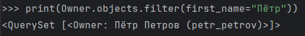

# Практическая работа №3.1
## **Практическое задание 1**
### Текст задания
Воспользуйтесь проектом из практики 2.1:

Напишите запрос на создание 6-7 новых автовладельцев и 5-6 автомобилей, каждому автовладельцу назначьте удостоверение и от 1 до 3 автомобилей. Задание можете выполнить либо в интерактивном режиме интерпретатора, либо в отдельном python-файле. Результатом должны стать запросы и отображение созданных объектов.

*Если вы добавляете автомобили владельцу через метод .add(), не забудьте заполнить также ассоциативную сущность “владение”*
### Выполненное задание

Создание 6 автовладельцев
```python
owner1 = Owner.objects.create(username="ivan_ivanov", first_name="Иван", last_name="Иванов", birth_date="1999-01-11")
owner2 = Owner.objects.create(username="petr_petrov", first_name="Пётр", last_name="Петров", birth_date="1998-02-22")
owner3 = Owner.objects.create(username="sergey_sergeev", first_name="Сергей", last_name="Сергеев", birth_date="1997-03-10")
owner4 = Owner.objects.create(username="nikolay_nikolaev", first_name="Николай", last_name="Николаев", birth_date="1996-04-20")
owner5 = Owner.objects.create(username="vasiliy_vasilyev", first_name="Василий", last_name="Васильев", birth_date="1995-05-01")
owner6 = Owner.objects.create(username="mikhail_mikhaylov", first_name="Михаил", last_name="Михайлов", birth_date="1994-06-02")
```
Создание 6 автомобилей
```python
car1 = Car.objects.create(license_plate="A123BE98", brand="Toyota", model="Camry", color="Black")
car2 = Car.objects.create(license_plate="B234EK98", brand="Honda", model="Civic", color="Blue")
car3 = Car.objects.create(license_plate="E345KM98", brand="Ford", model="Focus", color="Red")
car4 = Car.objects.create(license_plate="K456MH89", brand="Kia", model="Rio", color="Yellow")
car5 = Car.objects.create(license_plate="M567HO89", brand="Chevrolet", model="Tahoe", color="Grey")
car6 = Car.objects.create(license_plate="H678OP89", brand="Volkswagen", model="Polo", color="Green")
```
Назначение удостоверений для каждого автовладельца
```python
license1 = DriverLicense.objects.create(owner=owner1, license_number="1234567890", category="B", issue_date="2019-01-11")
license2 = DriverLicense.objects.create(owner=owner2, license_number="2345678901", category="B", issue_date="2018-02-22")
license3 = DriverLicense.objects.create(owner=owner3, license_number="3456789012", category="B", issue_date="2017-03-10")
license4 = DriverLicense.objects.create(owner=owner4, license_number="4567890123", category="B", issue_date="2016-04-20")
license5 = DriverLicense.objects.create(owner=owner5, license_number="5678901234", category="B", issue_date="2015-05-01")
license6 = DriverLicense.objects.create(owner=owner6, license_number="6789012345", category="B", issue_date="2014-06-02")
```
Назначение автомобилей автовладельцам
```python
Ownership.objects.create(owner=owner1, car=car1, date_start="2019-01-12", date_end="2020-01-11")
Ownership.objects.create(owner=owner1, car=car2, date_start="2021-01-11")

Ownership.objects.create(owner=owner2, car=car3, date_start="2018-02-23", date_end="2019-02-22")

Ownership.objects.create(owner=owner3, car=car4, date_start="2017-03-11", date_end="2018-03-10")
Ownership.objects.create(owner=owner3, car=car5, date_start="2019-03-10")

Ownership.objects.create(owner=owner4, car=car6, date_start="2016-04-21")

Ownership.objects.create(owner=owner5, car=car1, date_start="2020-01-12", date_end="2021-01-11")
Ownership.objects.create(owner=owner5, car=car3, date_start="2022-01-11")

Ownership.objects.create(owner=owner6, car=car4, date_start="2018-03-11")
Ownership.objects.create(owner=owner6, car=car5, date_start="2014-06-03", date_end="2015-06-02")
```
Вывод всех автовладельцев и их автомобилей
```python
for owner in Owner.objects.all():
    print(f"Owner: {owner.first_name} {owner.last_name}")
    for ownership in owner.ownership_set.all():
        print(f"  Car: {ownership.car.brand} {ownership.car.model}, License Plate: {ownership.car.license_plate}")
```

## **Практическое задание 2**
### Текст задания
По созданным в пр.1 данным написать следующие запросы на фильтрацию:
- Где это необходимо, добавьте related_name к полям модели
- Выведете все машины марки “Toyota” (или любой другой марки, которая у вас есть)
- Найти всех водителей с именем “Олег” (или любым другим именем на ваше усмотрение)
- Взяв любого случайного владельца получить его id, и по этому id получить экземпляр удостоверения в виде объекта модели (можно в 2 запроса)
- Вывести всех владельцев красных машин (или любого другого цвета, который у вас присутствует)
- Найти всех владельцев, чей год владения машиной начинается с 2010 (или любой другой год, который присутствует у вас в базе)
### Выполненное задание
Добавил `related_name` к полям моделей `DriverLicense` и `Ownership`, чтобы упростить доступ к связанным объектам через обратную связь. Например, вместо стандартного `driverlicense_set` я могу использовать `owner.driverlicense`, а для модели `Ownership` — `car.ownerships` или `owner.ownerships`. Это делает код более понятным и удобным для работы, особенно когда нужно получать связанные данные.
```python
class DriverLicense(models.Model):  
    owner = models.ForeignKey(settings.AUTH_USER_MODEL, on_delete=models.CASCADE, related_name="driverlicense")  
    license_number = models.CharField(max_length=10, null=False)  
    category = models.CharField(max_length=10, null=False)  
    issue_date = models.DateField(null=False)

class Ownership(models.Model):  
    owner = models.ForeignKey(settings.AUTH_USER_MODEL, on_delete=models.CASCADE, related_name="ownerships")  
    car = models.ForeignKey(Car, on_delete=models.CASCADE, related_name="ownerships")  
    date_start = models.DateField(null=False)  
    date_end = models.DateField(null=True)
```
Все машины марки “Toyota”
```python
print(Car.objects.filter(brand="Toyota"))
```

Все водители с именем “Пётр”
```python
print(Owner.objects.filter(first_name="Пётр"))
```

ID случайного владельца и удостоверение по этому ID
```python
random_owner_id = Owner.objects.order_by('?').first().id
print(random_owner_id)
print(DriverLicense.objects.get(owner_id=random_owner_id))
```

Все владельцы красных машин
```python
print(Owner.objects.filter(cars__color="Red"))
```

Все владельцы, чей год владения машиной начинается с 2019
```python
print(Owner.objects.filter(ownerships__date_start__year=2019).distinct())
```

## **Практическое задание 3**
### Текст задания
Необходимо реализовать следующие запросы c применением описанных методов:
- Вывод даты выдачи самого старшего водительского удостоверения
- Укажите самую позднюю дату владения машиной, имеющую какую-то из существующих моделей в вашей базе
- Выведите количество машин для каждого водителя
- Подсчитайте количество машин каждой марки
- Отсортируйте всех автовладельцев по дате выдачи удостоверения (Примечание: чтобы не выводить несколько раз одни и те же таблицы воспользуйтесь методом .distinct()
### Выполненное задание
Даты выдачи самого старшего водительского удостоверения
```python
print(DriverLicense.objects.aggregate(oldest_date=Min("issue_date")))
```

Самая поздняя дату владения машиной, имеющую какую-то из существующих моделей в базе
```python
print(Ownership.objects.aggregate(latest_date=Max("date_start")))
```

Количество машин для каждого водителя
```python
cars_per_driver = Owner.objects.annotate(car_count=Count("cars"))
for driver in cars_per_driver:
	print(f"Driver: {driver.username}, Car Count: {driver.car_count}")
```

Количество машин каждой марки
```python
car_count_by_brand = Car.objects.values("brand").annotate(count=Count("id"))
for entry in car_count_by_brand:
	print(f"Brand: {entry['brand']}, Count: {entry['count']}")
```

Сортировка всех автовладельцев по дате выдачи удостоверения
```python
owners_sorted_by_license = DriverLicense.objects.order_by("issue_date").distinct()
for license in owners_sorted_by_license:
	print(f"Owner: {license.owner.username}, Issue Date: {license.issue_date}")
```
