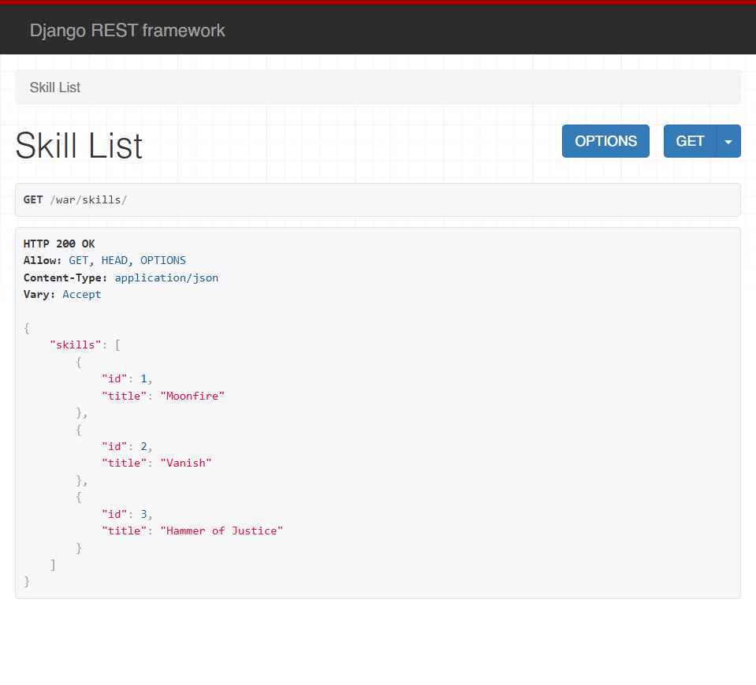
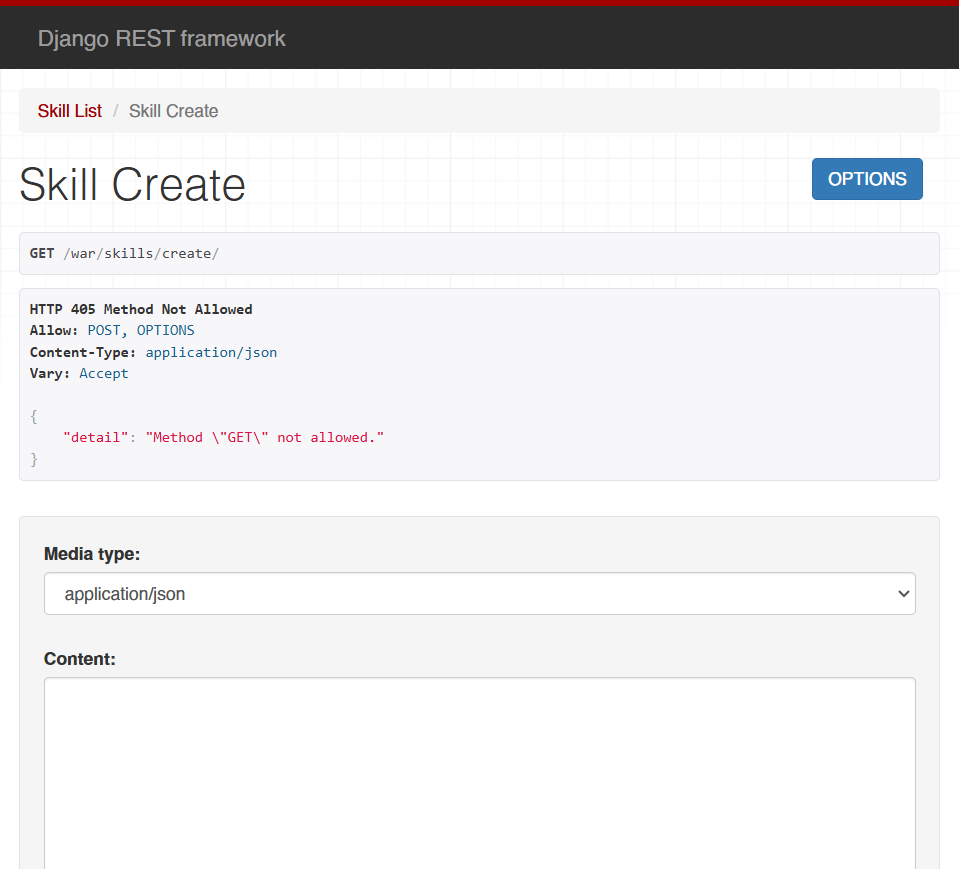
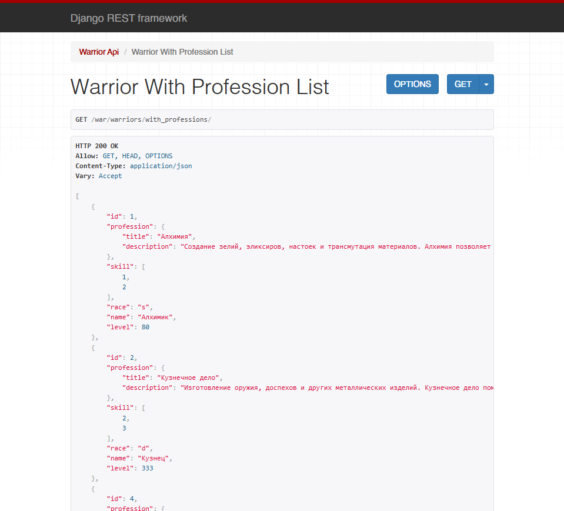
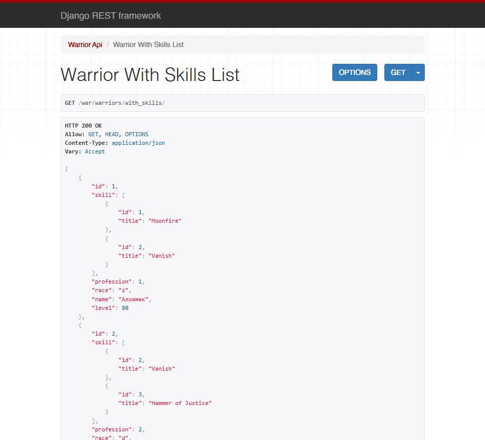
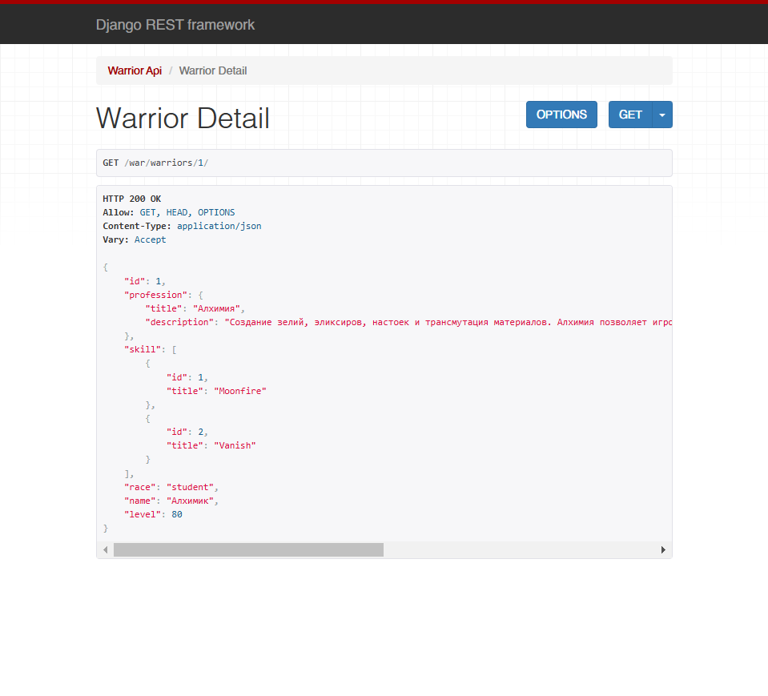
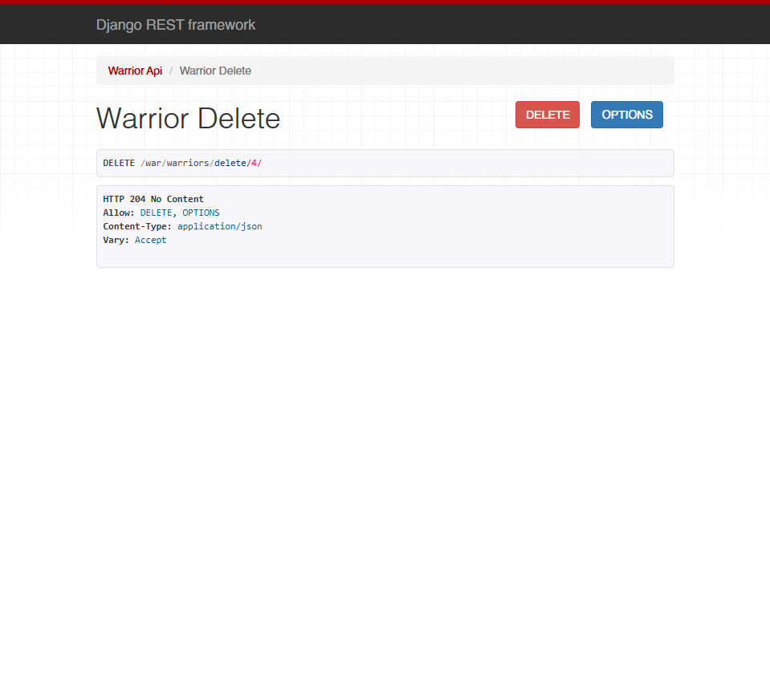
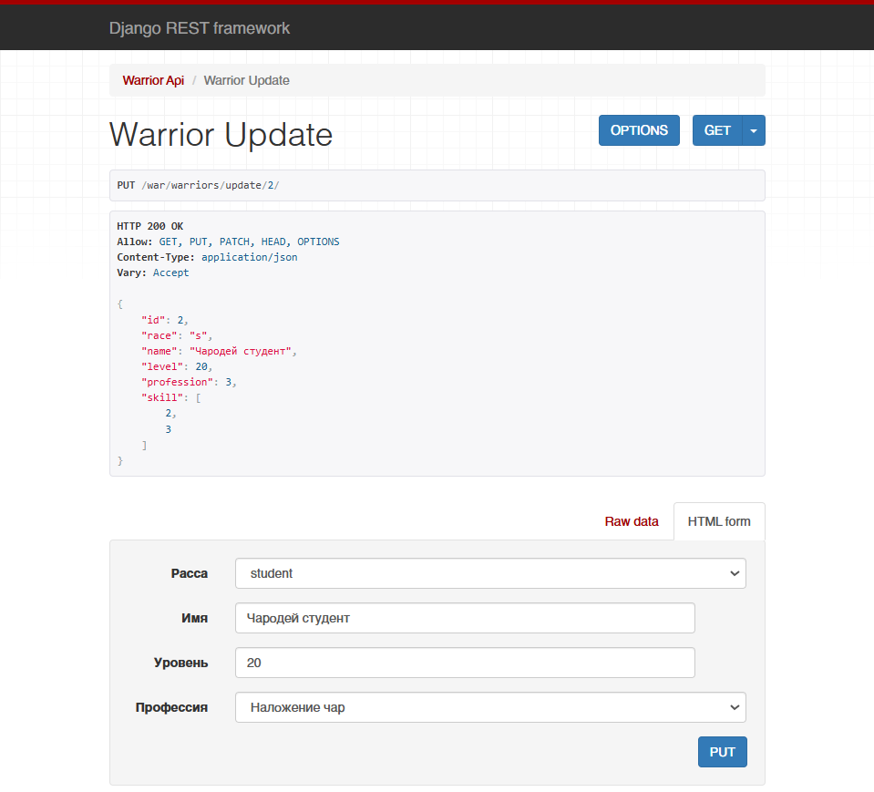

# Практическая работа №3.2

## **Практическое задание 1**

### Текст задания

Реализовать ендпоинты для добавления и просмотра скилов методом, описанным в пункте выше.

### Выполненное задание

Добавление сериализатора для модели `Skill`

serializers.py:

```python
class SkillSerializer(serializers.ModelSerializer):
    class Meta:
        model = Skill
        fields = "__all__"
```

Реализация представлений для просмотра и добавления навыков

views.py:

```python
class SkillListView(APIView):  
  
    def get(self, request):  
        skills = Skill.objects.all()  
        serializer = SkillSerializer(skills, many=True)  
        return Response({"skills": serializer.data})  
  
  
class SkillCreateView(APIView):  
  
    def post(self, request):  
        skill = request.data.get("skill")  
        serializer = SkillSerializer(data=skill)  
  
        if serializer.is_valid(raise_exception=True):  
            skill_saved = serializer.save()  
  
        return Response({"Success": "Skill '{}' created successfully.".format(skill_saved.title)})
```

Настройка маршрутов для эндпоинтов

urls.py:

```python
urlpatterns = [   
    ... 
    path('skills/', SkillListView.as_view()),  
    path('skills/create/', SkillCreateView.as_view()),  
]
```





## **Практическое задание 2**

### Текст задания

Реализовать ендпоинты:

- Вывод полной информации о всех войнах и их профессиях (в одном запросе).
- Вывод полной информации о всех войнах и их скилах (в одном запросе).
- Вывод полной информации о войне (по id), его профессиях и скилах.
- Удаление война по id.
- Редактирование информации о войне.

### Выполненное задание

Вывод полной информации о всех войнах и их профессиях (в одном запросе).

views.py:

```python
class WarriorWithProfessionListView(generics.ListAPIView):  
    serializer_class = WarriorWithProfessionSerializer  
    queryset = Warrior.objects.all()
```

serializers.py:

```python
class WarriorWithProfessionSerializer(serializers.ModelSerializer):  
    profession = ProfessionSerializer()  
    skill = serializers.PrimaryKeyRelatedField(many=True, read_only=True)  
  
    class Meta:  
        model = Warrior  
        fields = "__all__"
```

urls.py:

```python
urlpatterns = [
    ...
    path('warriors/with_professions/', WarriorWithProfessionListView.as_view()),
]
```



Вывод полной информации о всех войнах и их скилах (в одном запросе).

views.py:

```python
class WarriorWithSkillsListView(generics.ListAPIView):  
    serializer_class = WarriorWithSkillsSerializer  
    queryset = Warrior.objects.all()
```

serializers.py:

```python
class WarriorWithSkillsSerializer(serializers.ModelSerializer):  
    skill = SkillSerializer(many=True)  
    profession = serializers.PrimaryKeyRelatedField(read_only=True)  
  
    class Meta:  
        model = Warrior  
        fields = "__all__"
```

urls.py:

```python
urlpatterns = [
    ...
    path('warriors/with_skills/', WarriorWithSkillsListView.as_view()),
]
```



Вывод полной информации о войне (по id), его профессиях и скилах.

views.py:

```python
class WarriorDetailView(generics.RetrieveAPIView):  
    serializer_class = WarriorNestedSerializer  
    queryset = Warrior.objects.all()
```

urls.py:

```python
urlpatterns = [
    ...
	path('warriors/<int:pk>/', WarriorDetailView.as_view()),
]
```



Удаление война по id.

views.py:

```python
class WarriorDeleteView(generics.DestroyAPIView):  
    queryset = Warrior.objects.all()  
    serializer_class = WarriorSerializer
```

urls.py:

```python
urlpatterns = [
    ...
	path('warriors/delete/<int:pk>/', WarriorDeleteView.as_view()),
]
```



Редактирование информации о войне.

views.py:

```python
class WarriorUpdateView(generics.RetrieveUpdateAPIView):  
    queryset = Warrior.objects.all()  
    serializer_class = WarriorSerializer
```

urls.py:

```python
urlpatterns = [
    ...  
	path('warriors/update/<int:pk>/', WarriorUpdateView.as_view()),
]
```

