# Лабораторная работа 4. Реализация клиентской части средствами Vue.js.

Реализация клиентской части приложения средствами vue.js.

## [Вариант №6](https://drive.google.com/file/d/174gPjJ7AOHfzteYcobPY0x7sFBTkN1Xx/view?usp=sharing) из вариантов по курсу «Основы баз данных»

## Форма авторизация

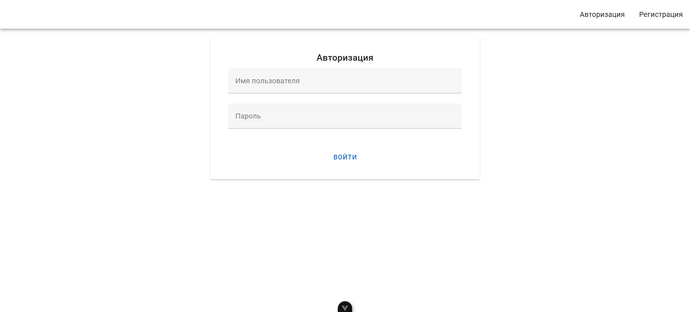

## Форма регистрации

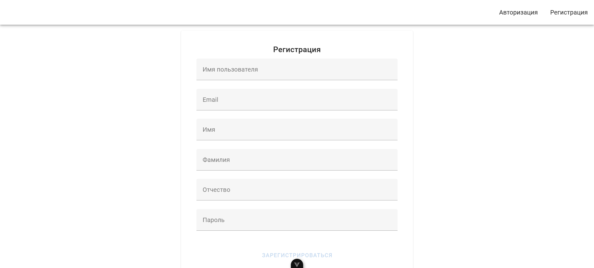

## Пользователи

### Список пользователей

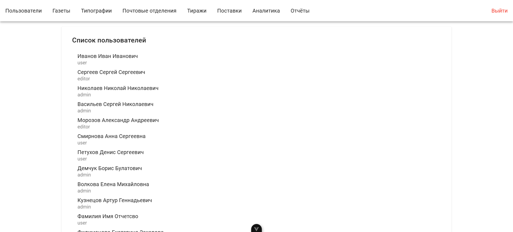

### Детали пользователя

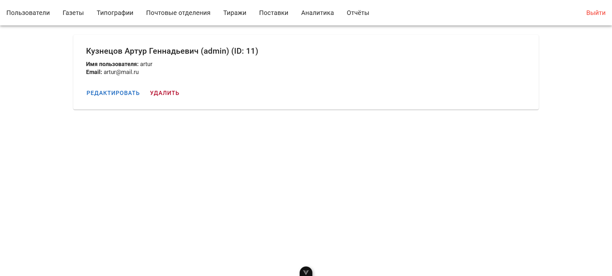

## Газеты

### Список газет

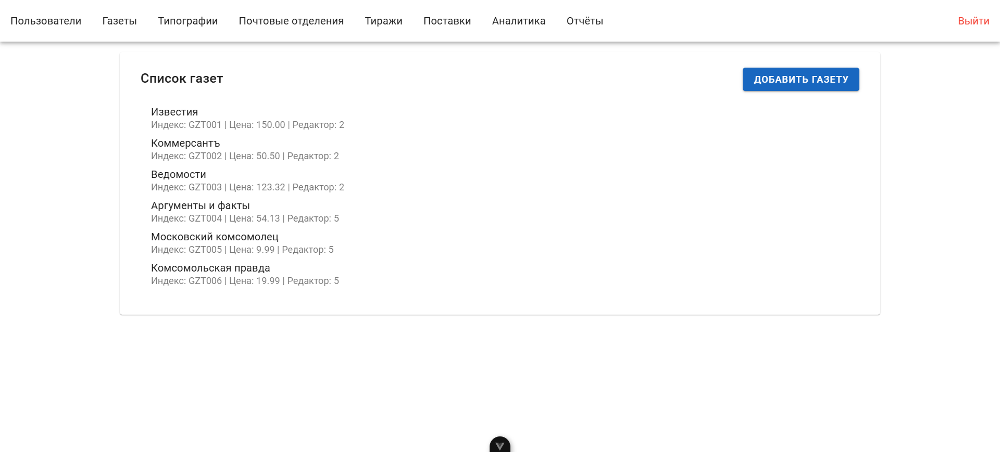

### Детали газеты

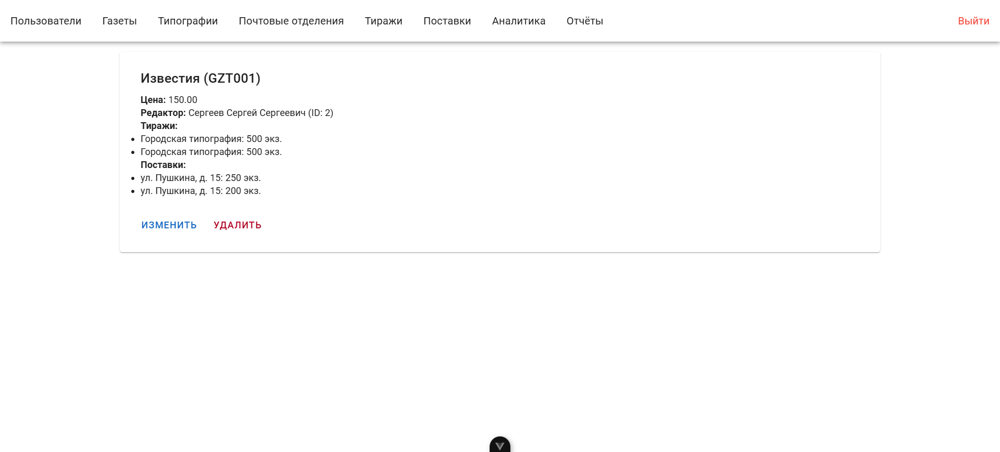

## Типографии

### Список типографий

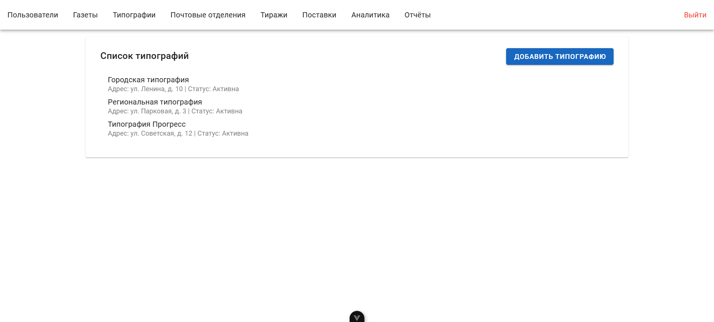

### Детали типографии

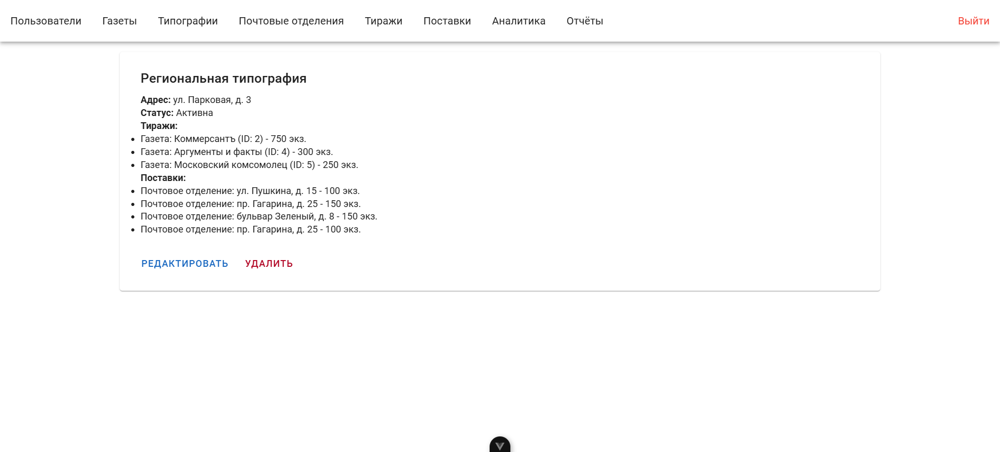

## Почтовые отделения

### Список почтовых отделений

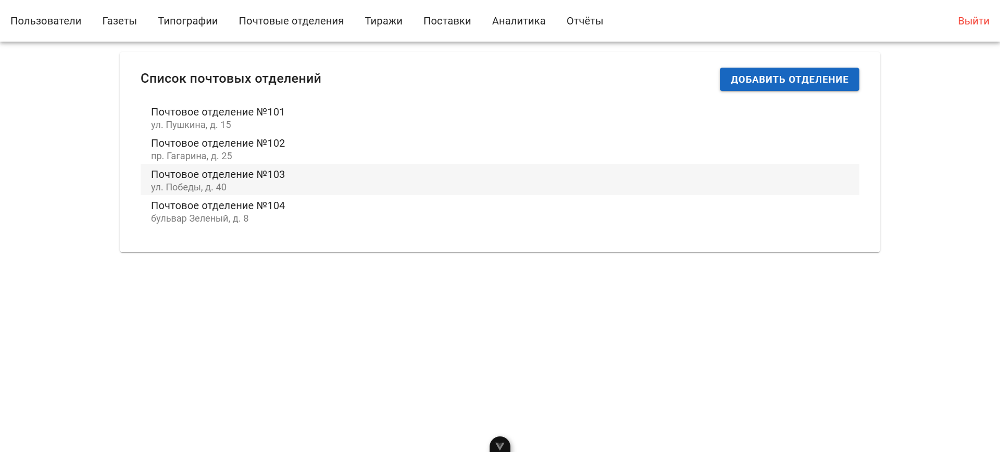

### Детали почтового отделения

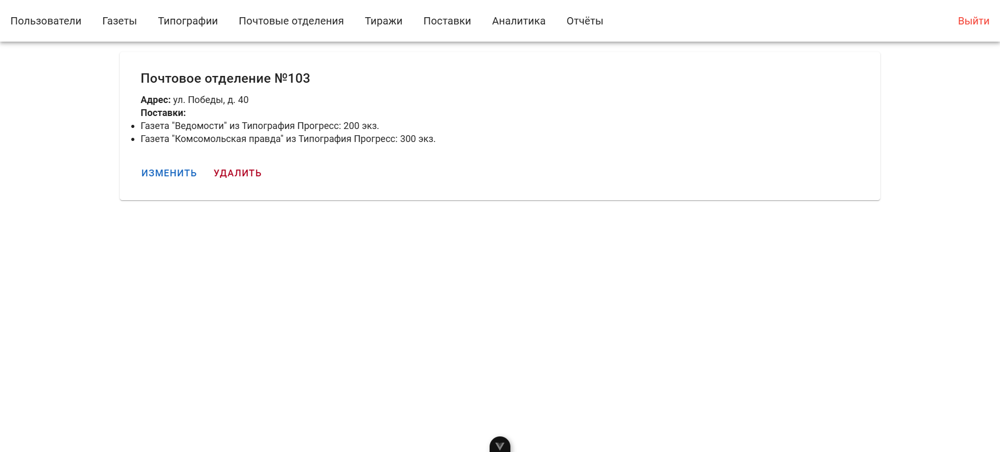

## Тиражи

### Список тиражей

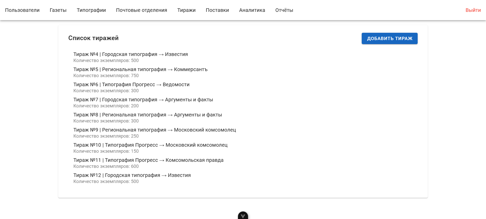

### Детали тиража

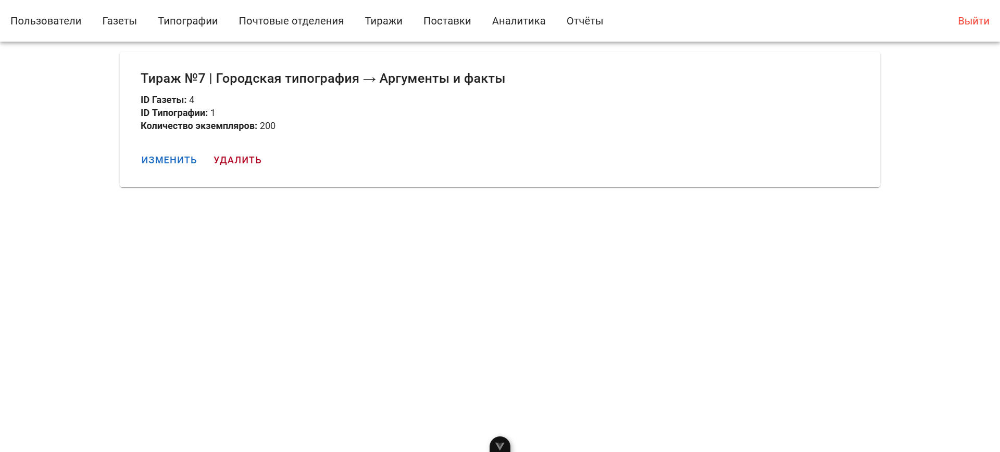

## Поставки

### Список поставок

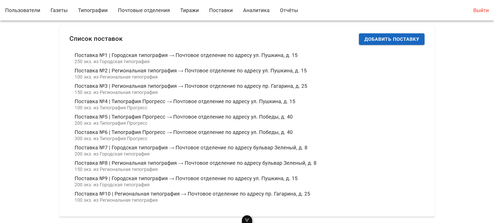

### Детали поставки

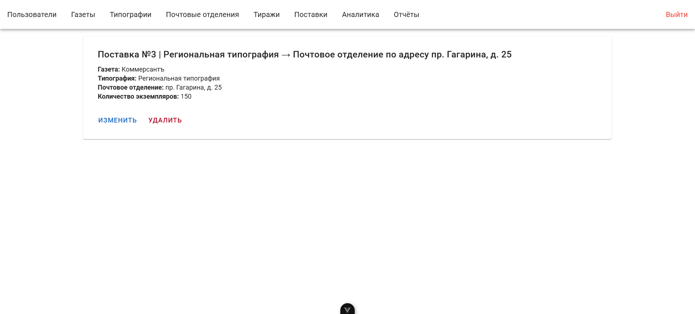

## Аналитика

## Отчёт

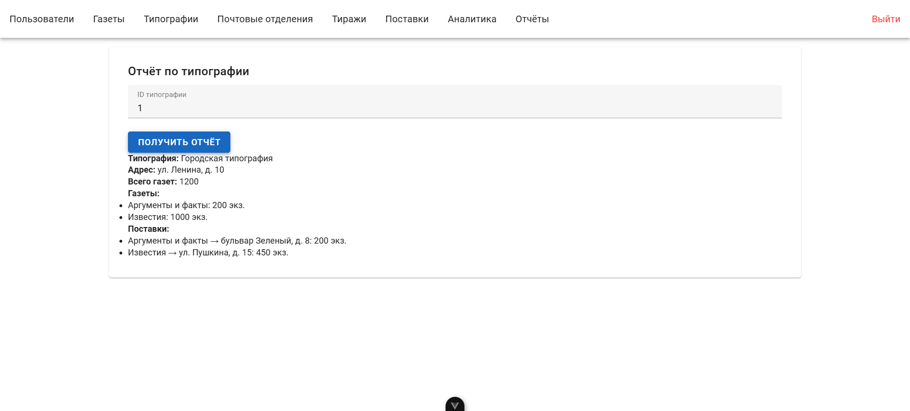

---

## App.vue

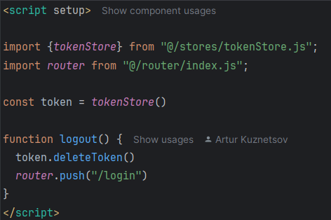

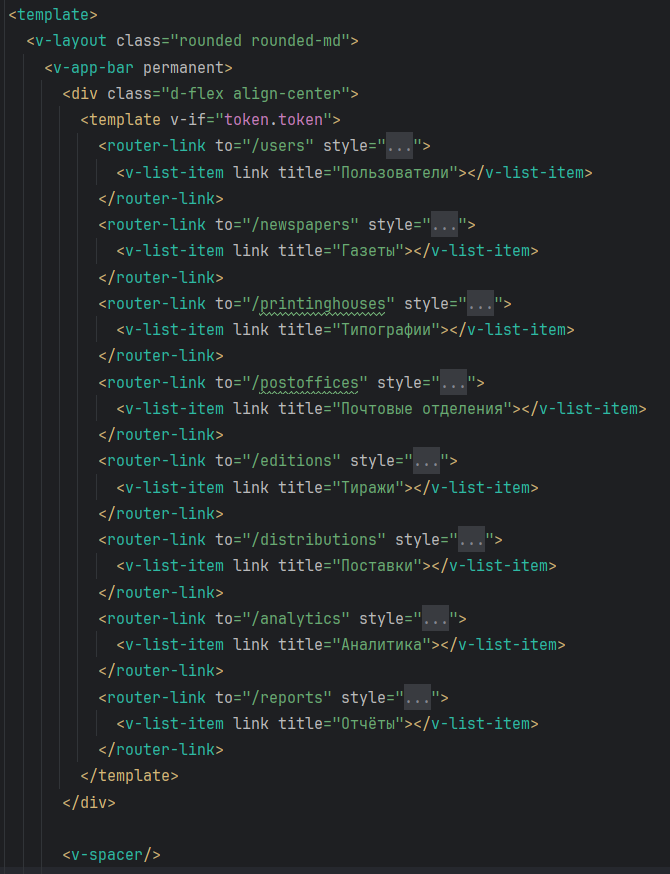

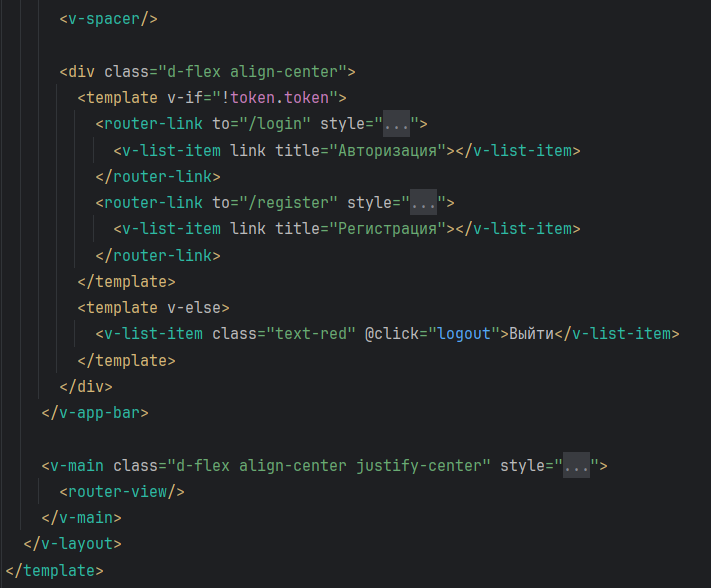

## main.js

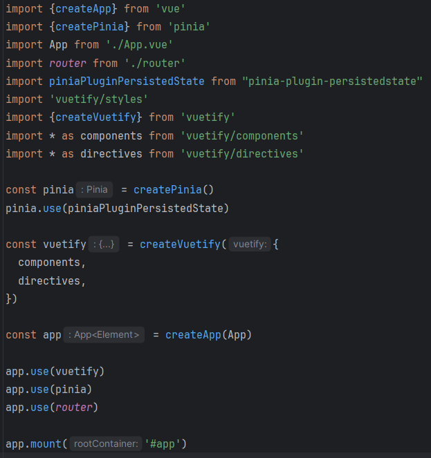

## tokenStore

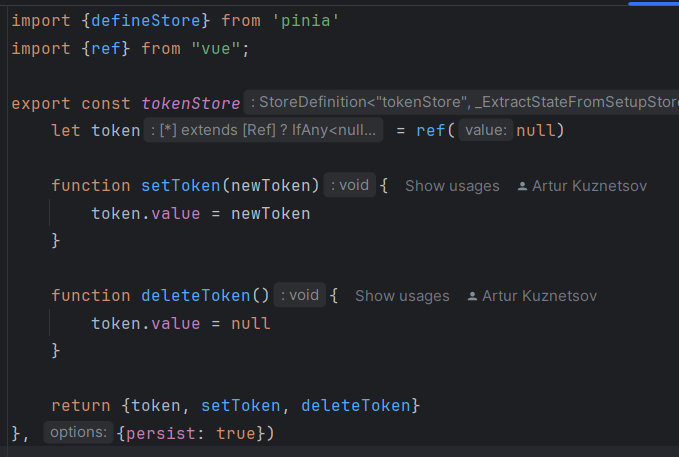

## userStore

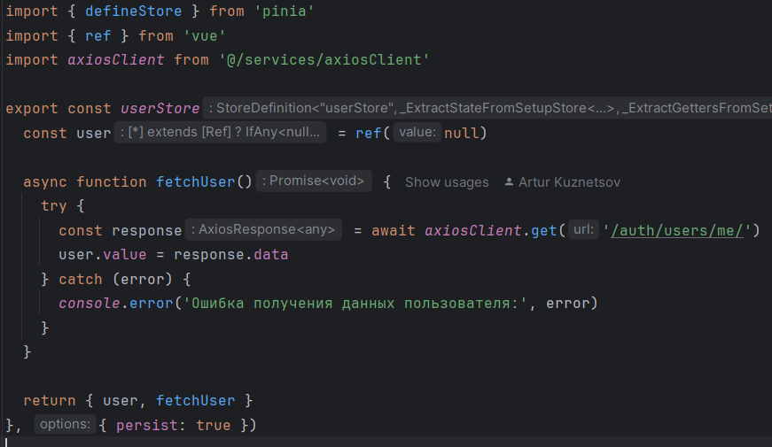
